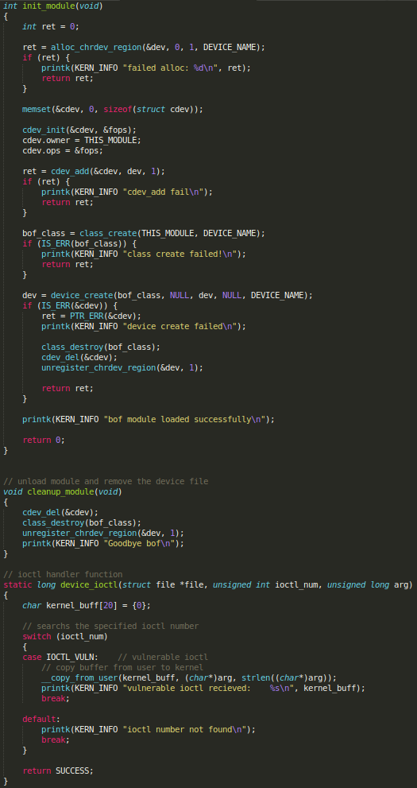
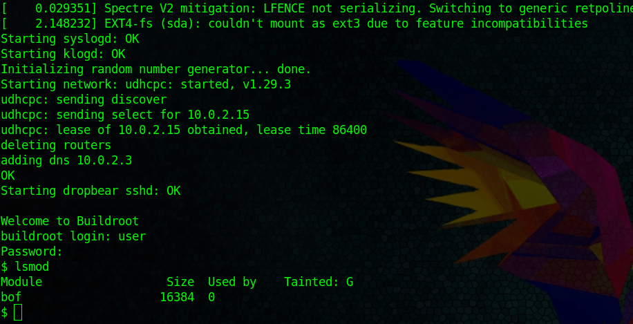
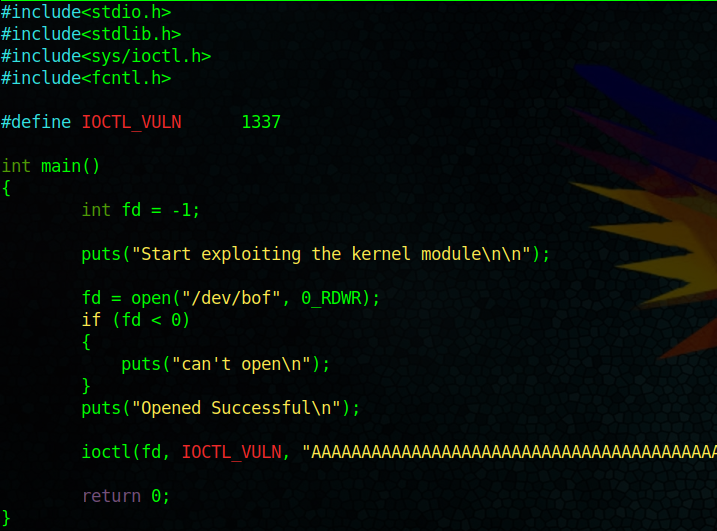
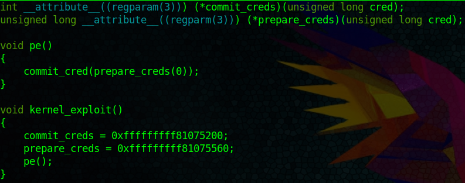
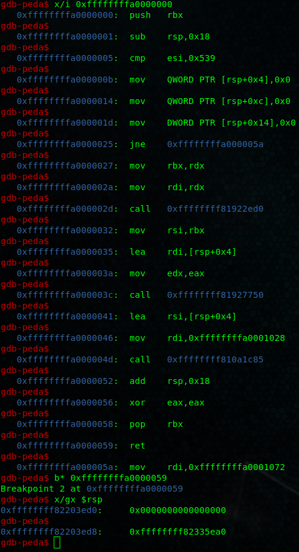

# Kernel Exploitation
I will present the first steps I learned in the operating system kernel exploitation- linux, what can be done, how to do it, and especially the basics that will open the kernel login gateway.This article is not about researching/exploiting weaknesses in the operating system but rather exploiting weaknesses that occure when we run in Kernel mode. In the field of binary exploitation, or know and understand the following:

* linux 
* kernel modules 
* C and Assembly 
* buffer overflow 

Kernel Mode can run 2 types of code: 
- Kernel code in the container operating system--The basic parts of the system run including memory manager, process manager, file system, etc.
- Kernel modules: It is a code that can be written, compiled, and loaded(You can also release/delete it from the system) Into the operating system as an "add-on" to the kernel with the rise of the computer (running code in Mode Kernel.) It is important to emphasize that the Module Kernel is not part of the original operating system kernel and does not come as part of the installation

So, if we want to look for operating system kernel weaknesses and we can look for weaknesses in kernel modules loaded to kernel and running in kernel. When dealing with programs running in User mode our input will usually come through the stdin (sometimes from files or possibly from the network in order to disrupt the program run we will need to input no Legitimate (too long/too short/unreadable characters, etc...). 


Now we want to send an input or change some value in a file/data structure so that we enter our input to the kernel. In fact, we want some function that you want in Mode Kernel to use the values we control in them. If the kernel has a function that works with strings, we want to send it a string. 
we can actually run a kernel function with data we control in User Mode. If, for example, a call system with a chance of overflow buffer is found, we can call a call system with a parameter like a very long string. Once we understand what code is running in the kernel, where it comes from, how we can run the code then it's time to try and exploit a vulnerable code running in the kernel. We will write a vulnerable kernel module, load it into a kernel, and try to exploit the weakness.

We will do the attack on a Linux machine running in the qemu simulator. I prefer this because I can compile the operating system according to our challenge which has no protections for them (We will use Linux version 0.15.4). We also need a file system so we will use the same ext2.
In the file system I created 2 Users that will be available

- **USERNAME**: user | **PASSWORD**: user
- **USERNAME**: root | **PASSWORD**: root



**module_init** - The function that will be run as soon as the module is loaded. The function is responsible for initializing
The module, in our case, create a file device with operations_file features that will support our ioctls.
**module_cleanup** - The function will be run as soon as we release the module. The function is responsible for restoring the
The system returns to its original state (before loading the module). In our case, remove the file device registry from the system.
**ioctl_device** - The ioctl management function, receives an ioctl ID number and runs the task. In our case there is an ioctl with ID number 1337 which receives a string parameter, copies it to Local Buffer, and prints a message that includes our parameter.

For convenience, we do not load the module we manually compiled each time we turn on the machine because if we do this multiple times during debugging and exploitation it will take time as we will load the Module Kernel in the process of computer rise in the init script. Now we'll turn on the machine and check if it works or not! 
{image1}
Our interaction with the module (input) will be with the help of ioctl-s. Unlike the exploits I write to User Mode in python, this time I'll write exploit in C, because we need to touch the functions, play a lot with memory, pointers, etc.
_Let's start from sending a legitimate Buffer to ioctl:_



During the task we will have to compile the exploit without PIE, and insert it into the machine file system. In order to save time we will compile all the commands in the bash script(we have names it `prep.sh`) you will do:
```
gcc exploit/exploit.c -o exploit/exploit -no-pie
mount rootfs.ext2 tmpfs
cp exploit/exploit tmpfs/home/user
umount tmpfs
```
Then we start the Victim Machine by running this:
```
qemu-system-x86_64 -kernel bzImage -drive file=rootfs.ext2,format=raw -net nic -net user,hostfwd=tcp::2222-:22,hostfwd=tcp::9999-:9999,hostfwd=tcp::8000-:8000 -nographic -append "root=/dev/sda console=ttyS0" -s
```
According to the source code and the program run we identified and understood What happens - There is an ioctl that receives a Buffer from the user and copies it to the Buffer in the kernel. Finally the module will print message with the Buffer we provided.
___
### Identifying the Vulnerability:

It is very simple to identify the weakness in the code. In the ioctl_device function, in ioctl number 1337 we copy Buffer Coming from the Mode User (length is unknown) can be anything because it is a fully controlled value from the User Mode) into a Local Buffer in a 20-byte kernel, with no testing done before. What might happen? 
**You guessed it right - A Overflow Buffer!**

If the user's Buffer is long enough, we will actually copy it all into the local Buffer in the ioctl_device run function in Kernel Mode. As it is a local variable, it sits on the stack of the same process (the stack kernel) and at the moment of copying we will override the return address that sits in the stack and in fact we disrupt the proper run of the function we will jump to an unmapped address or anywhere we direct the program's flow (it will already be in the kernel). Each process has 2 cartridges, the standard cartridge we know in Mode User, and another cartridge in Kernel Mode to manage the process flow as it moves to Mode Kernel 2. The cartridges are used for the same the job is to open frames stack for the running functions, save local variables, and save addresses. The cartridge in Mode Kernel is usually very small relative to the cartridge in Mode User. Let's check this: Shipped Buffer really big:



As We Expected: We inserted a really large Buffer, the module copied it into the Buffer (smaller (in the cartridge) Of the kernel, and so we basically run over the return address that sits in the stack. When the module finished running its function, it returned to the address stored in the cartridge (return address), In our case we ran it with AAAAAAAA and it jumped to 0x4141414141414141 (Husky value of the character A in hexa = 41.) This address is obviously not mapped in memory and ... oops we got fault segmentation! So we control the return address and we can jump to where we need it. But the question I asked was myself at first, is that where Bali jumps? _In CTFs I execute code to leak address in libc and jump to system with sh / bin / or maybe some Chain ROP etc._ But it turns out that in Kernel the story is really similar, we can do everything as in User Mode Different but a similar idea and get a shell. But wait a minute, we're in the kernel, why don't we do some cool stuff :p? Most of the time, in cases we want to get high privileges for the process from which we run, this will give us the opportunity to run Code with root permissions on the system. But in this case we can do whatever comes to our mind, whether it is Change the address of a handler call system, write to memory, to disk, briefly go crazy until we feel it is enough Of course (without breaking the system too much). In our first task, we will try to get root privileges in the process we are running, and then return to User Mode to run code with the permissions we obtained.
___
#### A bit about Linux permissions
- In this section I will explain right at the fork about the permissions that the linux operating system has Based on users, each user has his or her own unique identifier. ---The `ld` command, also called the linkage editor or binder, combines object files, archives, and import files into one output object file, resolving external references. It produces an executable object file that can be run. In addition to their existing users, there are users having high system privileges and are usually called root. They are unique because their level of permissions, but so does their root ID id (which is 0), and thus the operating system can identify it with high privileges.

- The kernel has a data structure called `struct_task` that contains information that is relevant to the operating system. For the process, the current variable points to the current process that runs, in which a cred indicates the identifiers the users. `Basically euid-> cred-> current contains the process id`. If we are at the operating system level, we will change the variable that describes our user's id to the owner's id Root) which is id number 0, the operating system will see us as a process running as a root user. 
- If we entered Mode Kernel from a normal user-run process without high privileges by chance our user, we would like to change the user id outline in the operating system structures. So our goal is actually to `current->cred->euid=0` 
- You must be wondering how exactly will we do this? "Now we have to build some crazy shellcode in a kernel that will change the value of the above variable to 0 "? So yes, basically it's an option - we can write shellcode And change the id to 0 but there is a much simpler way!
There is a kernel function that does this for us:
```
prepare_kernel_cred - This calls prepare_kernel_cred(0),returns a pointer to a struct cred with
full capabilities and privileges (root).
```
The function gets a parameter(in case we want to root then we send 0) and returns a cred data structure Which contains the permissions of an id user with the value 0. 
```
commit_cred - applies the credentials to the current task
```
The function changes the cred data structure of the current process, in the data structure it receives. If we connect everything together we get 2 functions that will do the job for us - make our process a master process with Root permissions.

Okay so we got root permissions but we still can't run shell commands still running in Kernel Mode, and in order to bounce Shell we have to go back to User Mode. So Mode Kernel came in relatively easily, we called ioctl and with it entered Mode Kernel. The question now is
How to get back to User Mode, safely and correctly, without disrupting or crashing the system. Basically in order to return from Kernel Mode we have to recover a few things:
1. The SS and CS registers that contain an appropriate descriptor of the Mode User
2. The SP register that will point to a mapped area and fits in memory so we have a stack
3. Register the IP to run any code that is already in User Mode
4. Register the Flags

We do this with the help of an assembly command that is used to return from Mode Kernel `iret - pops from the stack IP, CS, EFLAGS, SP, SS`
In our case we will use the iretq command. The command does exactly the same with only 64 bit values. In addition, we will need to run swapgs(exchanges the current GS base register value with the value contained in MSR address, which store references to kernel data structure) before returning to User Mode. So in short, swapg and iretq will return us to User Mode.

Now that we have received permissions, and left the Mode Kernel back to Mode User, what should we do?
If we are satisfied with the situation we have created(Getting high privileges). But we are not interested in the process running, we want to run code on the system on root permissions so we are have to get `/bin/sh`. We can do this very easily. In our exploit in the first place we will write what function we will run `system("/bin/sh");` We will compile the exploit without PIE (the segment code will not change and we will know the addresses of the functions) so we can tell which IP to return to the function that will bounce us SHELL after exiting Kernel Mode.
___
#### Exploit
We talked enough, let's write some code. We will summarize our tasks in order to reach the final goal - Run code on computer (commands shell) with root permissions:
1. Write a payload that contains multiple characters) Fill the buffer in the kernel until the return address (and finally the
Return address we want
2. Run the functions and get root
3. Jump to a function in User Mode that will pop us a shell to run code with root privileges

**Writing the Payload**

First we need to know how many bytes we need to fill in Buffer until we override the return address. I always use this tool (https://wiremask.eu/tools/buffer-overflow-pattern-generator/).To find the offset for the return address from our Buffer start:

From what we see, in order to override the return address we must send to a string module that consists of:
- 28 characters (bytes) no matter what is the main fill of the buffer
- 8 bytes representing the return address

Change permissions level: As we said before, to change the current level of permissions we need two Kernel functions:
- prepare_kernel_cred
- commit_creds

But what is their address? Where are we supposed to jump? They are inaccessible from the Mode User (where we claim + Running the Exploit) The answer to all these questions is `/proc/kallsyms`. This file contains a list of all the kernel symbols including those loaded with kernel modules and their address in memory


In the picture you can see symbols from the kernel and the modules they claimed. So basically we can know the address commit_creds- and prepare_kernel_cred the functions of


We have addresses, let's play a little with pointers




What did we do here? We declared function pointers, we started them with their addresses according to what we found in
`kallsyms`, and we called to run it. We've reached the halfway point, let's check that everything is running as planned, and we jump to our function: exploit_kernel:


Since we compiled our exploit without PIE we can know the address of the function `exploit_kernel` and debug will be easy:


So the function's address is: `0x401231`. At the function we expect to return to:


Let's see what happened: This time it breaks point back from the ioctl_device function, where we're supposed to jump
To the address we want and run the exploit



Okay, we stopped for a moment before reting to the value written at rsp. But wait, what is it? We want to go back to 0x400652, why do we go back to 0xffffffff81400652? Look closely you will see that the address we return to contains the address we want to return. Where did the numbers 0 xffffffff81 come from? Let's take a second look at Kernel Module again:


Oh well! we get it now! Note that we copy from the user Buffer to the kernel Buffer the number of bytes `strlen` Returns to us. `strlen` returns the size of the string until it runs out - and in the C string ends when there is `NULL`
We send to the kernel (in Hexa):

```
\x41 * 28 + \x52\x06\x40\x00\x00\x00\x00\x00
```

But what's copied to the kernel's Buffer will be null

```
\x41 * 28 + \x52\x06\x40
````

We only run 3 bytes from the return address. The other numbers we see are the values of the original return address that remain in place because We've run them over from here, we will probably jump to an unmapped address and get segmentation fault. So, What is to be done to overcome the problem? Think creatively, and go a little crooked to jump where we want. Basically our goal is to jump to 0x400652, in other words we want the value 0x400652 Will register rip, without sending the address on payload to kernel - because the address will not be copied entirety as we have already seen what we can do is change the value of rsp to the address we control in User Mode (name put return address to 0 x400652 - exploit_kernel, then return ret) to address written in rsp. If in the first place (User Mode) we will erase the memory (or memory already mapped), The address of the function we intend to return to when the gadget runs the kernel basically replaces the cartridge pointer to the address we selected and controlled, and will return to the address that it writes (in the new cartridge). That way we can get back to the address we wanted without writing it directly in the payload sent to the module:

[image](./img/img14.png)

First we have to find all the gadgets in the kernel - with the help of: ROPgadget. This is a tool that shows sequences of assembled code snippets in the executable files that the last command in sequence affects the ip register with jmp/ret and so'. But note that you run it on a kernel file rather than on compression / wrapping files like their common bzimage. If you do not have the elf in your network, you can also use: ()

Now let's look for the appropriate gadget and we can seem to have found something good enough. We will map the base address 0x1400000 to memory, and at 0x1428dd2 We will enter the address to which we return (ie: exploit_kernel.) In addition to the return address that women in
the overload buffer payload will be the address of the gadget we selected) The address contains exactly 8 values and none of them equals null so you won't have a copy problem and we'll go back to that address.


